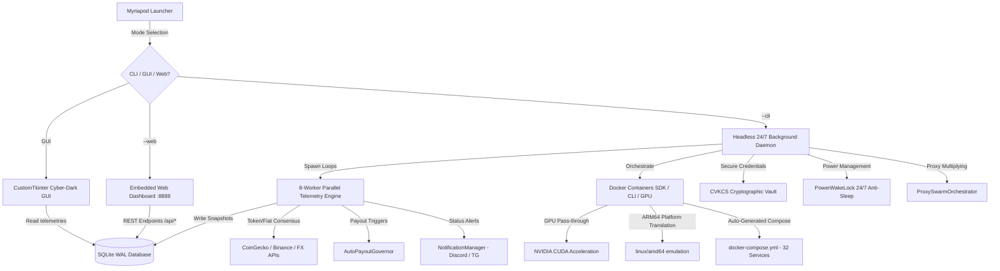

<div align="center">
  
  
  # Myriapod v0.1.0
  
  ### *The Ultimate Modular Passive Income Swarm Engine & DePIN Aggregator*
  
  [](https://github.com/HackerPrat)
  [](https://paypal.me/furiouslysharting)
  [](LICENSE)
  [](https://github.com/HackerPrat)
  [-00d4ff?style=for-the-badge&logo=docker)](https://www.docker.com/)

  *Set it, forget it, and scale infinitely. Myriapod orchestrates, monitors, and auto-deploys your passive bandwidth, compute, and storage monetization nodes into a unified, cybernetic, and highly secure dashboard. Now featuring 32 100% auto-deployable DePIN services, RFC 5389 STUN NAT diagnostics, Cloudflare edge speedtests, 48-replica proxy swarm generation, an embedded mobile Web Dashboard, 24/7 PowerWakeLock, Hardware GPU pass-through, and Multi-Currency Consensus.*
</div>

---

**Myriapod** is an overengineered, ultra-resilient, passive income swarm aggregator designed to manage and monitor dozens of background monetization nodes. By leveraging lightweight Docker orchestration, parallel 8-worker JSON-API telemetry, live crypto/fiat consensus engines, an embedded responsive Web Dashboard, and secure local vault protection, Myriapod guarantees maximum uptime and continuous long-term passive earnings without user intervention.

Built for complete platform agnosticism, it runs seamlessly in GUI desktops, headless servers, background daemons, and system services on **Windows, Linux, and macOS**. It natively supports **32 fully integrated DePIN services**—now **100% automatically deployable via Docker** with zero manual-only or monitor-only fallbacks.

---

## 🚀 Key Features & Capabilities (v0.1.0)

- 🐳 **100% Autonomous Docker-Auto for All 32 Services**: Every single node (32/32) is fully Dockerized (`docker_mode="docker_auto"`). Zero "monitor only", zero "manual setup". All containers deploy with 1-click via Docker SDK or `docker compose`.
- 🌐 **Embedded Mobile Web Dashboard & REST API (`--web`)**: Zero-dependency `ThreadingHTTPServer` on port `8888` serving a sleek, cyber-dark responsive single-page web app. Monitor balances, track real-time telemetry, and trigger single-click container deploy/stop actions from any browser or phone on your local network.
- 🛰️ **RFC 5389 UDP STUN NAT Diagnostics & IP Quality Scorer (`--nat-test`)**: Pure-Python UDP STUN client probing Google/Cloudflare STUN servers. Discovers external IP and mapped ports, classifies NAT traversal (Open Internet, Full/Restricted Cone, Symmetric), performs ISP/ASN lookup, and evaluates residential earning multipliers (up to 2.5x).
- 🚀 **Streamed Cloudflare Edge Network Benchmark Engine (`--speedtest`)**: Zero-dependency pure-Python HTTP streamed benchmark measuring download/upload throughput and latency/jitter against Cloudflare's global edge CDN. Calculates transferable monthly egress bandwidth (TB) and passive revenue yields.
- 🐝 **Multi-Instance Proxy Swarm Orchestrator (`--swarm-multiply`)**: Overcomes 1-node-per-IP limits by generating multi-replica container topologies routing through residential proxies (`ProxyPoolManager`), multiplying active nodes into 48+ isolated container instances in `data/docker-compose-swarm.yml`.
- ⚡ **24/7 Uninterrupted Uptime (`PowerWakeLock`)**: Prevents host OS sleep, standby, or hibernation (via Windows `SetThreadExecutionState`, macOS `caffeinate`, and Linux systemd locks) so network sockets remain open and earning 24/7 while allowing displays to power down.
- 🎮 **Hardware GPU Acceleration (`GPUComputeOptimizer`)**: Auto-detects NVIDIA CUDA GPUs on the host and injects `--gpus all` / device reservations into compute DePIN workloads (Akash, Fluence, Flux, Titan) for maximized compute yield.
- 🔄 **Residential Multi-IP Proxy Pool (`ProxyPoolManager`)**: Paste HTTP/SOCKS5 proxies to benchmark latency, resolve egress IPs, and run multiple parallel node replicas across distinct residential IP addresses.
- 💰 **Autonomous 24/7 Auto-Payout Engine (`AutoPayoutGovernor`)**: Automatically redeems balances when payout thresholds are met (programmatic API integration for EarnApp, IPRoyal Pawns, TraffMonetizer, and Repocket) with immediate Discord/Telegram notifications.
- 💱 **Multi-API Currency & Crypto Consensus Engine (`CurrencyManager`)**: 
  - Real-time exchange rate consensus across 12 major fiat currencies (USD, EUR, GBP, INR, JPY, CAD, AUD, CHF, SGD, CNY, NZD, BRL).
  - Multi-tier crypto consensus feeds (CoinGecko API + Binance Live Tickers) for Grass, Storj, Arweave, TFUEL, Flux, Akash, and Solana.
- 📊 **Multi-Format Financial Accounting & P&L Reports**: Export comprehensive historical ledgers with 1-click in **Markdown P&L**, **JSON Ledger**, or **CSV** format.
- 🛡️ **Native OS Boot Auto-Start (`WindowsAutoStartManager` & `ServiceInstaller`)**: One-command service configuration for Windows Registry Run keys, Linux systemd unit files, and macOS launchd daemons.
- 🖼️ **Self-Unpacking Visual Assets**: Automatically extracts high-resolution embedded 128x128 PNG (`Myriapod.png`) and ICO (`Myriapod.ico`) assets on startup if missing, guaranteeing zero broken image paths.
- 🎨 **Cybernetic Bioluminescent UI**: Dark-mode aesthetic directly color-coded around the glowing emerald-green centipede logo with live HUD telemetry stats.

---

## 🏛️ Architecture Design & Lifecycle Flow

Myriapod is structured as a dual-component architecture consisting of a **Headless background daemon** and an **interactive CustomTkinter GUI client**, complemented by an **embedded Web Dashboard & REST API**. The GUI connects dynamically to the running daemon via shared SQLite locks, avoiding database collisions and ensuring client-only mode whenever the daemon is active.



---

## 📦 Supported DePIN Swarm Services (32/32 Docker-Auto)

| # | Service | Category | Telemetry Mode | Payout / Reward Model | Docker Container Image | Docker Mode |
|---|---|---|---|---|---|---|
| 1 | **Grass** | Bandwidth / AI | API / Session | Points → GRASS (Solana) | `myriapod_grass_v7:latest` | `docker_auto` |
| 2 | **Honeygain** | Bandwidth | API / OAuth | Credits → PayPal / JumpTask | `honeygain/honeygain:latest` | `docker_auto` |
| 3 | **EarnApp** | Bandwidth | Python SDK | USD → PayPal (Auto-Payout) | `fazalfarhan01/earnapp:lite` | `docker_auto` |
| 4 | **IPRoyal Pawns** | Bandwidth | Python SDK / API | USD → PayPal / Bitcoin | `iproyal/pawns-cli:latest` | `docker_auto` |
| 5 | **TraffMonetizer** | Bandwidth | API Token | USD → USDT TRC-20 / BTC | `traffmonetizer/cli_v2:latest` | `docker_auto` |
| 6 | **PacketStream** | Bandwidth | Session Scrape | USD → PayPal | `packetstream/psclient:latest` | `docker_auto` |
| 7 | **EarnFM** | Bandwidth | API Key | USD → PayPal / Crypto | `earnfm/earnfm-client:latest` | `docker_auto` |
| 8 | **Repocket** | Bandwidth | JWT / API Key | USD → PayPal | `repocket/repocket:latest` | `docker_auto` |
| 9 | **Proxyrack** | Bandwidth | Peer Dashboard | USD → PayPal / Crypto | `proxyrack/pop:latest` | `docker_auto` |
| 10 | **Bitping** | Bandwidth | Node Status | USD → Solana | `bitping/bitpingd:latest` | `docker_auto` |
| 11 | **Bytelixir** | Bandwidth | Auto-OCR / API | USD → Crypto | `myriapod_bytelixir:latest` | `docker_auto` |
| 12 | **Nodepay** | Bandwidth / AI | Web3 Token | Points → Solana | `kellphy/nodepay:latest` | `docker_auto` |
| 13 | **Dawn Network** | Bandwidth / Solana | API Token | Points → Solana | `myriapod_dawn:latest` | `docker_auto` |
| 14 | **PacketShare** | Bandwidth | API Key | USD → PayPal | `packetshare/packetshare:latest` | `docker_auto` |
| 15 | **Peer2Profit** | Bandwidth | Dashboard API | USD → Crypto | `peer2profit/peer2profit_x86_64:latest` | `docker_auto` |
| 16 | **Gradient Network** | Bandwidth / AI | API Token | Points → Solana | `mrcolorrain/gradient-bot:latest` | `docker_auto` |
| 17 | **BlockMesh** | Bandwidth / AI | API Token | Points → Solana | `blockmesh/blockmesh-cli:latest` | `docker_auto` |
| 18 | **Pipe Network** | Bandwidth / CDN | Node Metrics | Points → Solana | `pipenetwork/pop-node:latest` | `docker_auto` |
| 19 | **Titan Network** | Storage / DePIN | Local RPC / API | Points → TITAN | `nezha123/titan-edge:latest` | `docker_auto` |
| 20 | **Bless Network** | Compute / AI | Node Status | Points → Token | `mrcolorrain/bless-bot:latest` | `docker_auto` |
| 21 | **Mysterium** | VPN Node | TequilAPI (4449) | MYST Token → Polygon | `mysteriumnetwork/myst:latest` | `docker_auto` |
| 22 | **Sentinel** | VPN Node | Cosmos LCD Nodes | DVPN Token → Cosmos | `ghcr.io/sentinel-official/sentinel-dvpnx:latest` | `docker_auto` |
| 23 | **GagaNode** | Storage Node | Dashboard Token | Points → Token | `jepbura/gaganode:latest` | `docker_auto` |
| 24 | **Storj** | Decentralized Storage | Node API (14002) | STORJ Token → Ethereum | `storjlabs/storagenode:latest` | `docker_auto` |
| 25 | **Arweave** | Permanent Storage | Gateway RPC | AR Token | `arweaveteam/arweave:latest` | `docker_auto` |
| 26 | **Theta Edge** | Video / AI Compute | RPC API | TFUEL Token | `thetalabsorg/edgelauncher_mainnet:latest` | `docker_auto` |
| 27 | **Fluence** | Compute Cloud | Blockscout L2 | FLT Token | `fluencelabs/nox:latest` | `docker_auto` |
| 28 | **Acurast** | Serverless Compute | Console API | ACU Token | `acurast/processor:latest` | `docker_auto` |
| 29 | **Akash Network** | GPU Compute Cloud | Cosmos LCD | AKT Token | `ghcr.io/akash-network/provider:latest` | `docker_auto` |
| 30 | **Flux Network** | Cloud Compute | FluxOS RPC | FLUX Token | `runonflux/flux:latest` | `docker_auto` |
| 31 | **SubQuery** | Decentralized Indexing | Network API | SQT Token | `subquerynetwork/subql-coordinator:latest` | `docker_auto` |
| 32 | **Watchtower** | System Maintenance | Docker Daemon | Auto-updates all containers | `containrrr/watchtower:latest` | `docker_auto` |

---

## 🛠️ Zero-Code Custom Service Extension

Myriapod supports **infinite dynamic extension**. You can add new DePIN networks simply by declaring their schema rules inside `custom_services.json`:

```json
[
  {
    "name": "CustomNode",
    "slug": "customnode",
    "website_url": "https://example.org",
    "dashboard_url": "https://app.example.org",
    "payout_url": "https://app.example.org",
    "threshold": 10.0,
    "category": "bandwidth",
    "setup_fields": [
      {
        "key": "CUSTOM_TOKEN",
        "label": "Custom Auth Token",
        "secret": true,
        "hint": "Grab your token from the developer dashboard",
        "required": true
      }
    ],
    "balance_mode": "api",
    "balance_unit": "usd",
    "earnings_model_note": "Custom DePIN bandwidth verification node.",
    "payout_note": "Payouts managed via official dashboard.",
    "docker_mode": "docker_auto",
    "compose_image": "customnode/node:latest",
    "compose_env_templates": [
      "TOKEN={CUSTOM_TOKEN}"
    ],
    "api_balance_url": "https://api.example.org/api/user/earnings",
    "json_path": ["data", "balance"],
    "headers": {
      "Authorization": "Bearer {CUSTOM_TOKEN}"
    }
  }
]
```

---

## 🔒 Cryptographic Vault Key Consensus System (CVKCS)

All credentials and API tokens are encrypted at rest using `AES-256` Fernet keys derived from dynamic machine hardware locks and salting.

```
                  ┌───────────────────────────────┐
                  │   Cached Master Key File      │
                  │   (.vault_master_key) [0600]  │
                  └──────────────┬────────────────┘
                                 │ Valid?
                                 ▼
                     ┌───────────────────────┐
                     │   Consensus Decrypt   │◄─────── [Decrypt Success]
                     │   Check against Vault │
                     └───────────┬───────────┘
                                 │
                   Fails? ───────┼───────────────┐
                                 ▼               ▼
                 ┌──────────────────────────┐  ┌──────────────────────────┐
                 │ Derive Keys from Seed    │  │ Derive Keys from Seed    │
                 │ Candidate A (MachineID)  │  │ Candidate B (Legacy MAC) │
                 └──────────────┬───────────┘  └──────────────┬───────────┘
                                │                             │
                                ▼                             ▼
                     ┌───────────────────────────────────────────┐
                     │       Decryption Consensus Check          │
                     └───────────────────┬───────────────────────┘
                                         │
                             ┌───────────┴───────────┐
                             ▼                       ▼
                    [Consensus Achieved]     [Consensus Failed]
                             │                       │
                             ▼                       ▼
                     Cache Winning Key       Backup corrupted vault,
                     to .vault_master_key    Generate new strong key.
```

---

## ⚡ Installation & Quick Start

### 1. Prerequisites
- **Python**: v3.8 or higher.
- **Docker & Docker Compose**: (Recommended for 1-click container deployment).

### 2. Fast Clone & Launch
```bash
# Clone the repository
git clone https://github.com/HackerPrat/Myriapod.git
cd Myriapod

# Run the Graphical UI
python3 Myriapod.py
```

### 3. Headless Terminal, Web & Diagnostic Commands

| Command | Description |
| :--- | :--- |
| `python Myriapod.py --web` | Launch embedded **Web Dashboard & REST API** on `http://localhost:8888` |
| `python Myriapod.py --speedtest` | Run pure-Python **Cloudflare edge speedtest** and passive income yield calculator |
| `python Myriapod.py --nat-test` | Run **RFC 5389 STUN NAT diagnostics**, IP quality score & earning multiplier test |
| `python Myriapod.py --swarm-multiply` | Generate **multi-replica proxy swarm compose spec** (48 replicas) in `data/` |
| `python Myriapod.py --status` | Display tabular status, balances, and active node counts |
| `python Myriapod.py --deploy-all` | Deploy **all 32 DePIN swarm containers** with 1 command |
| `python Myriapod.py --write-compose` | Export complete **32-service `docker-compose.yml`** |
| `python Myriapod.py --cli --setup` | Interactive terminal credential configuration wizard |
| `python Myriapod.py --cli` | Start 24/7 background telemetry polling daemon |
| `python Myriapod.py --preflight` | Run comprehensive system and dependency diagnostic checks |
| `python Myriapod.py --install-service` | Install 24/7 auto-start background service on boot (Windows/Linux/macOS) |
| `python Myriapod.py --payout-all` | Trigger immediate auto-payout check across all supported providers |
| `python Myriapod.py --export-csv` | Export historical telemetry ledger to CSV |
| `python Myriapod.py --export-json` | Export historical telemetry ledger to JSON |
| `python Myriapod.py --export-md` | Generate executive Markdown Profit & Loss report |

---

## 🌐 Embedded Web Dashboard REST API

When running `python Myriapod.py --web`, the following JSON endpoints are live on port `8888`:

- `GET /api/status` — Returns full swarm health, active nodes, total USD wealth, and 32-service telemetry.
- `POST /api/poll` — Triggers an immediate asynchronous balance re-poll across all nodes.
- `POST /api/deploy` — Body: `{"service": "<slug>"}` — Deploys the specified Docker container.
- `POST /api/stop` — Body: `{"service": "<slug>"}` — Stops the specified Docker container.
- `GET /api/speedtest` — Runs on-demand Cloudflare network benchmark and returns throughput metrics.
- `GET /api/nat` — Runs RFC 5389 STUN diagnostics and returns NAT classification + IP quality score.
- `GET /api/logs` — Streams the latest 50 entries from `myriapod.log`.
- `GET /api/csv` — Downloads the complete telemetry history as a `.csv` spreadsheet.

---

## 🛡️ Security & Privacy Guarantee

- **100% Local**: No API keys, credentials, or wallet seeds ever leave your host machine.
- **Zero Cloud Middlemen**: All telemetry polls directly from official service endpoints.
- **Encrypted at Rest**: Vault encrypted via Fernet `AES-256` keys with automatic consensus healing.
- **Crash Resilient**: SQLite database operates in full WAL journal mode with automatic pruning and checkpointing.

---

## 💖 Support & Donations
If Myriapod helps you orchestrate your passive income nodes and maximize your DePIN earnings, consider supporting independent open-source development!

[](https://paypal.me/furiouslysharting)

---

## 👤 Author
Developed and maintained with absolute premium precision by **[HackerPrat](https://github.com/HackerPrat)**.

---

## 📄 License
This project is licensed under the MIT License - see the [LICENSE](LICENSE) file for details.
