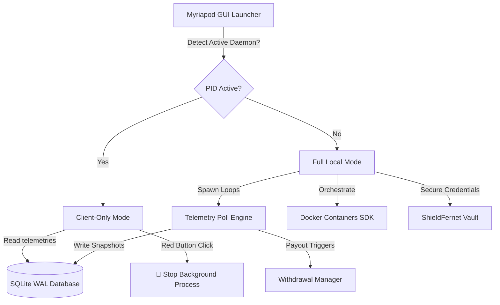

<div align="center">
  
  
  # Myriapod v1.0.0
  
  ### *The Ultimate Modular passive Income Swarm Engine & DePIN Aggregator*
  
  [](https://github.com/HackerPrat)
  [](https://paypal.me/furiouslysharting)
  [](LICENSE)
  [](https://github.com/HackerPrat)
  [](https://www.docker.com/)

  *Set it, forget it, and scale infinitely. Myriapod orchestrates, monitors, and auto-deploys your passive bandwidth, compute, and storage monetization nodes into a unified, hardened dashboard.*
</div>

---

## ⚡ Introduction

**Myriapod** is an overengineered, ultra-resilient, passive income swarm aggregator designed to manage and monitor dozens of background monetization nodes. By leveraging lightweight Docker orchestration, highly accurate JSON-API telemetry, and secure local vault protection, Myriapod guarantees maximum uptime and continuous long-term earnings without user intervention.

Built for complete platform agnosticism, it runs seamlessly in constrained sandbox environments, GUI desktops, headless servers, and background daemons.

---

## 🧬 Zero-Code Custom Service Extension (New!)

Myriapod supports **infinite dynamic extension**. You do not need to modify a single line of core Python code to add newly released DePIN networks (like *Nodepay*, *Dawn Network*, *BlockMesh*, *Gradient Network*, or *Kuzco*). 

Simply declare your service inside [custom_services.json](file:///home/hacka/Desktop/Projects/Centipede/custom_services.json):

```json
[
  {
    "name": "Nodepay",
    "slug": "nodepay",
    "website_url": "https://nodepay.org",
    "dashboard_url": "https://app.nodepay.org",
    "payout_url": "https://app.nodepay.org",
    "threshold": 10.0,
    "category": "bandwidth",
    "setup_fields": [
      {
        "key": "NODEPAY_TOKEN",
        "label": "Nodepay Web3 Token",
        "secret": true
      }
    ],
    "balance_mode": "api",
    "balance_unit": "usd",
    "compose_image": "nodepay/node:latest",
    "compose_env_templates": ["TOKEN={NODEPAY_TOKEN}"],
    "api_balance_url": "https://api.nodepay.org/api/user/earnings",
    "json_path": ["data", "total_usd"],
    "headers": {
      "Authorization": "Bearer {NODEPAY_TOKEN}"
    }
  }
]
```

### What Myriapod does automatically with custom configurations:
1. **Settings Panel**: Automatically generates input forms and secures credentials in the AES-256 vault.
2. **Dashboard UI**: Generates a dynamic status row, balance outputs, and launch redirect buttons.
3. **Docker Orchestrator**: Compiles and runs container workloads with dynamic environment mapping.
4. **Telemetry Engine**: Executes real-time REST polling, applies JSON path extraction, and plots earnings charts.

---

## 🛡️ Core Hardening Features

Myriapod v1.0.0 is hardened for 24/7 autonomous operations:

*   **🦂 AetherDaemon (Background Persistence)**: Allows the GUI window to be closed while running completely autonomously as a detached double-forked background process.
*   **🔌 Smart Client-Only Mode**: Automatically connects subsequent GUI instances to the running background daemon. Reuses database channels to display active statistics and avoids lock collisions.
*   **🛡️ ShieldFernet & ChromeConsole (Fallback Modules)**: Zero-external-dependency fallbacks. Uses pure-Python cryptography and ansi-escape modules to allow execution in isolated sandbox systems where binary wheels (`cryptography` or `colorama`) cannot compile.
*   **📦 AetherLoader Packager**: In-memory source compiler, gzip compressor, and HMAC-CTR stream cipher encryptor. Package your customized engine into a secure, machine-locked runner (`Myriapod_secure.py`) from the settings tab.
*   **🌐 Universal Browser Engine**: Bypasses unstable default redirection by natively looking up and targeting the user's primary default browser (`Chrome`, `Firefox`, `Brave`, `Opera`, `Edge`, `Safari`) across all platforms.
*   **💓 Earning Watchdog Heartbeat**: Periodically writes diagnostic telemetry to a localized heartbeat file, permitting integration with host daemon runners.

---

## 🛠️ Installation & Setup

### 1. Prerequisites
- **Python**: v3.8 or higher.
- **Docker & Docker Compose**: (Recommended for automatic node deployments).

### 2. Docker Permissions (Crucial for Linux)
To ensure the orchestrator can connect to the Docker daemon without permission denied locks, configure your host:
```bash
# 1. Start and enable Docker
sudo systemctl start docker
sudo systemctl enable docker

# 2. Add your current user to the docker group
sudo usermod -aG docker $USER

# 3. Apply group permissions instantly
newgrp docker
```

### 3. Fast Clone & Start
```bash
# Clone the repository
git clone https://github.com/HackerPrat/Myriapod.git
cd Myriapod

# Run the Graphical UI
python3 Myriapod.py
```

### 4. Headless Terminal Commands
For servers, remote terminals, or sandboxed SSH systems:
```bash
# Start the initial setup wizard to securely encrypt your API credentials
python3 Myriapod.py --cli --setup

# Start monitoring and daemon execution in the background
python3 Myriapod.py --cli

# Perform immediate pre-flight diagnostics
python3 Myriapod.py --preflight

# Automatically compile a clean docker-compose.yml including all configured nodes
python3 Myriapod.py --write-compose
```

---

## 🎨 Premium Modern UI

Myriapod features a bespoke dark-mode interface built on **CustomTkinter** following strict professional aesthetics:

- 🟢 **Harmonious HSL Palettes**: Designed with curated, sleek dark colors (Pitch Black `#0d1117` and Soft Emerald `#39d353` accents).
- 📈 **Dynamic Vector Charts**: Integrates real-time matplotlib vector graphs showing earnings progressions and payouts history.
- 📬 **Live Notification Center**: Push notifications and logs showing threshold alerts, payout confirmations, and IP changes.

---

## 🏗️ Architecture Design



---

## 🔒 Security & Safe Sandboxes
All secrets and API tokens configured within the engine are instantly encrypted at rest via high-grade `AES-256` keys derived from system-level machine locks and dynamic salting. 
- *No credentials ever leave your host system.*
- *SQLite database operates in full WAL (Write-Ahead Logging) journal mode, maintaining data integrity during sudden reboots.*

---

## ☕ Support & Donations
If Myriapod helps you orchestrate your passive income nodes and maximize your DePIN earnings, consider supporting independent open-source development!

[](https://paypal.me/furiouslysharting)

---

## 👤 Author
Developed and maintained with absolute premium precision by **[HackerPrat](https://github.com/HackerPrat)**. 

*Contributions, bug-fixes, and overengineered ideas are welcome! Feel free to open a Pull Request or issue.*

---

## 📄 License
This project is licensed under the MIT License - see the [LICENSE](LICENSE) file for details.
