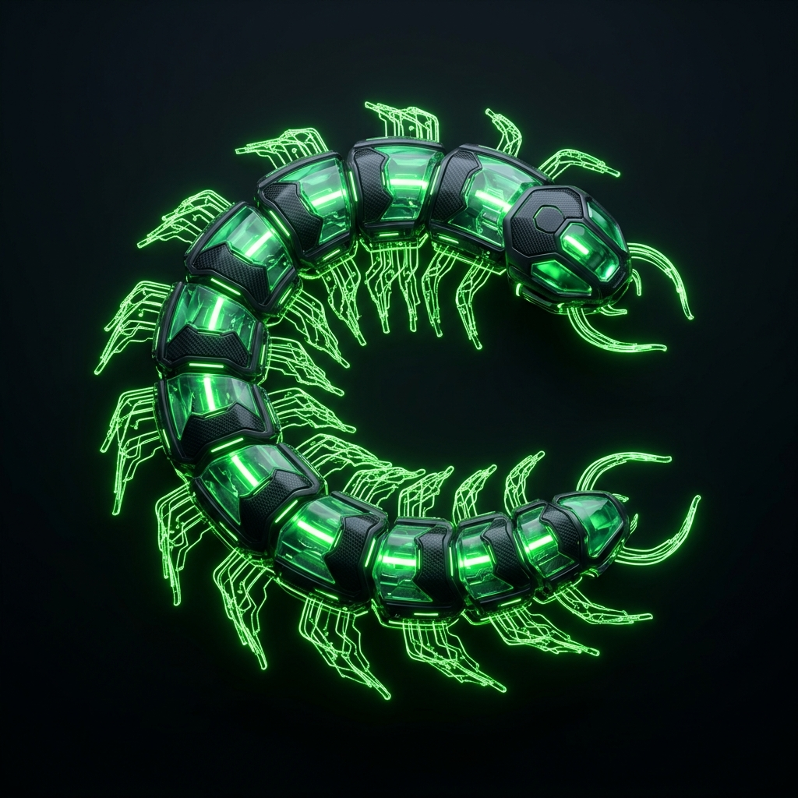
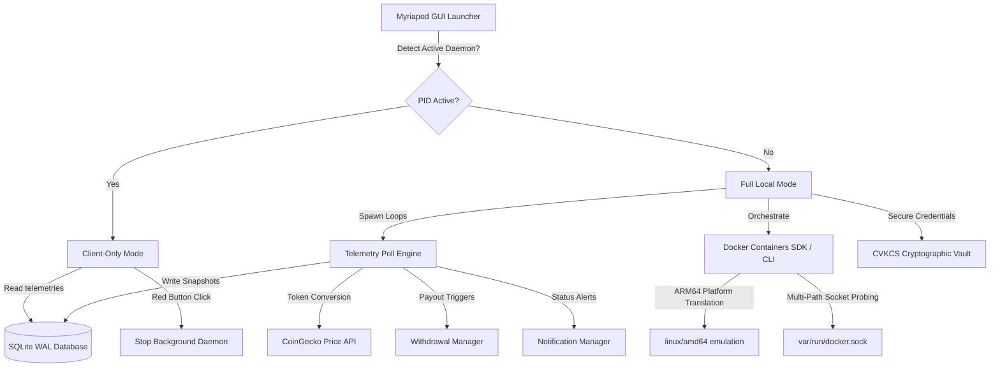

<div align="center">
  
  
  # Myriapod v1.0.0
  
  ### *The Ultimate Modular Passive Income Swarm Engine & DePIN Aggregator*
  
  [](https://github.com/HackerPrat)
  [](https://paypal.me/furiouslysharting)
  [](LICENSE)
  [](https://github.com/HackerPrat)
  [](https://www.docker.com/)

  *Set it, forget it, and scale infinitely. Myriapod orchestrates, monitors, and auto-deploys your passive bandwidth, compute, and storage monetization nodes into a unified, hardened, and highly secure dashboard.*
</div>

---

## Introduction

**Myriapod** is an overengineered, ultra-resilient, passive income swarm aggregator designed to manage and monitor dozens of background monetization nodes. By leveraging lightweight Docker orchestration, highly accurate JSON-API telemetry, and secure local vault protection, Myriapod guarantees maximum uptime and continuous long-term earnings without user intervention.

Built for complete platform agnosticism, it runs seamlessly in constrained sandbox environments, GUI desktops, headless servers, and background daemons.

---

## Architecture Design & Lifecycle Flow

Myriapod is structured as a dual-component architecture consisting of a **Headless background daemon** and an **interactive CustomTkinter GUI client**. The GUI connects dynamically to the running daemon via shared SQLite locks, avoiding database collisions and ensuring client-only mode whenever the daemon is active.



### Core Architecture Components:
1. **AetherDaemon (Background Persistence)**: Double-forks the telemetry process into a detached background daemon, allowing you to close the GUI window while keeping the background nodes running and monitoring.
2. **Telemetry Poll Engine**: A thread-safe loop that queries API balances, caches responses with exponential back-off, resolves native token values using the CoinGecko API, and flushes historical records to SQLite.
3. **Dual-Mode Docker Orchestrator**: Prioritizes the Python Docker SDK, falling back automatically to the `docker-compose` CLI, and eventually to raw `docker run` subprocess commands if SDK channels are unavailable.

---

## Zero-Code Custom Service Extension

Myriapod supports **infinite dynamic extension**. You do not need to modify a single line of core Python code to add newly released DePIN networks (such as *Nodepay*, *Dawn Network*, *BlockMesh*, *Gradient Network*, or *Kuzco*). 

Simply declare the network rules inside `custom_services.json`:

```json
[
  {
    "name": "Nodepay",
    "slug": "nodepay",
    "website_url": "https://nodepay.org",
    "dashboard_url": "https://app.nodepay.org",
    "payout_url": "https://app.nodepay.org",
    "threshold": 10.0,
    "category": "bandwidth",
    "setup_fields": [
      {
        "key": "NODEPAY_TOKEN",
        "label": "Nodepay Web3 Token",
        "secret": true,
        "hint": "Grab your Bearer token from the network tab on app.nodepay.org",
        "required": true
      }
    ],
    "balance_mode": "api",
    "balance_unit": "usd",
    "earnings_model_note": "AI Bandwidth sharing and DePIN verification node.",
    "payout_note": "Withdraw via Solana wallet inside Nodepay dashboard.",
    "docker_mode": "docker_auto",
    "docker_support_level": "community",
    "docker_source_url": "https://hub.docker.com/r/nodepay/node",
    "docker_summary": "Auto-deploy Nodepay client container.",
    "compose_image": "nodepay/node:latest",
    "compose_env_templates": [
      "TOKEN={NODEPAY_TOKEN}"
    ],
    "api_balance_url": "https://api.nodepay.org/api/user/earnings",
    "json_path": ["data", "total_usd"],
    "headers": {
      "Authorization": "Bearer {NODEPAY_TOKEN}"
    }
  }
]
```

### JSON Schema Field Specification:

| Field | Type | Description |
|---|---|---|
| `name` | String | User-friendly name displayed in GUI lists and notification cards. |
| `slug` | String | Unique identifier used for containers, database tables, and directories. |
| `category` | String | Categories (`bandwidth`, `node`, `storage`, `compute`, `system`) to apply HSL colors. |
| `threshold` | Float | The USD value at which a threshold alert or payout trigger is activated. |
| `setup_fields` | Array | Defines input forms. If `secret` is true, values are masked in GUI and encrypted. |
| `balance_mode` | String | Telemetry acquisition method (`api` for polling, `cli` for command output, `mock`). |
| `balance_unit` | String | Unit value type (e.g., `usd`, `points`, `myst`, `sol`). Drives UI formatting. |
| `coingecko_id` | String | (Optional) CoinGecko simple-price coin id to convert tokens to USD in real-time. |
| `compose_image` | String | Target Docker Image tag to pull and run. |
| `compose_env_templates` | Array | Env variables passed to the container. Curly braces `{FIELD_NAME}` resolve dynamically. |
| `api_balance_url` | String | URL to poll balance telemetry. Dynamically interpolates tokens. |
| `json_path` | Array | Walking path to extract the final balance float from the API JSON response. |

---

## Cryptographic Vault Key Consensus System (CVKCS)

All secrets and API tokens configured within the engine are instantly encrypted at rest via high-grade `AES-256` keys derived from system-level machine locks and dynamic salting. 

To prevent key corruption during system upgrades or hostname changes, Myriapod uses an overengineered **Cryptographic Vault Key Consensus System (CVKCS)**:

```
                  ┌───────────────────────────────┐
                  │   Cached Master Key File      │
                  │   (.vault_master_key) [0600]  │
                  └──────────────┬────────────────┘
                                 │ Valid?
                                 ▼
                     ┌───────────────────────┐
                     │   Consensus Decrypt   │◄─────── [Decrypt Success]
                     │   Check against Vault │
                     └───────────┬───────────┘
                                 │
                   Fails? ───────┼───────────────┐
                                 ▼               ▼
                 ┌──────────────────────────┐  ┌──────────────────────────┐
                 │ Derive Keys from Seed    │  │ Derive Keys from Seed    │
                 │ Candidate A (MachineID)  │  │ Candidate B (Legacy MAC) │
                 └──────────────┬───────────┘  └──────────────┬───────────┘
                                │                             │
                                ▼                             ▼
                     ┌───────────────────────────────────────────┐
                     │       Decryption Consensus Check          │
                     └───────────────────┬───────────────────────┘
                                         │
                             ┌───────────┴───────────┐
                             ▼                       ▼
                    [Consensus Achieved]     [Consensus Failed]
                             │                       │
                             ▼                       ▼
                     Cache Winning Key       Backup corrupted vault,
                     to .vault_master_key    Generate new strong key.
```

### Key Derivation Seed Hierarchy:
1. **Candidate A (Hardware ID Bound)**: Derived from `/etc/machine-id` or `/var/lib/dbus/machine-id` (Linux) or registry path `HKLM\SOFTWARE\Microsoft\Cryptography\MachineGuid` (Windows).
2. **Candidate B (Legacy Combo)**: Combines MAC address (`uuid.getnode()`), Hostname (`platform.node()`), and Arch.
3. **Candidate C (Stable Combo)**: Combines MAC address and CPU architecture (hostname-agnostic).
4. **Candidate D (MAC-Only)**: Simple fallback using MAC address.

Master keys are cached locally in `.vault_master_key` and locked with strict Unix `0600` owner-only read/write privileges.

---

## SQLite WAL Telemetry Storage

Myriapod stores all logs and telemetry records in an optimized SQLite database configured with **Write-Ahead Logging (WAL)**:

*   **Concurrency**: WAL mode allows concurrent readers to query history while the Telemetry daemon writes, eliminating database locks.
*   **Synchronous Normal**: Restricts filesystem syncing write overhead while protecting database integrity from app-level crashes.
*   **Automatic Checkpointing**: Executes a passive checkpoint (`PRAGMA wal_checkpoint(PASSIVE);`) every 5 writes to flush WAL logs to the disk.

### Schema Specifications:

```sql
CREATE TABLE IF NOT EXISTS earnings_history (
    id               INTEGER PRIMARY KEY AUTOINCREMENT,
    timestamp        DATETIME DEFAULT CURRENT_TIMESTAMP,
    service          TEXT NOT NULL,
    balance_usd      REAL NOT NULL,
    source           TEXT DEFAULT '',
    native_value     REAL,
    native_unit      TEXT DEFAULT 'usd',
    include_in_total INTEGER DEFAULT 1
);
CREATE TABLE IF NOT EXISTS withdrawals (
    id                 INTEGER PRIMARY KEY AUTOINCREMENT,
    timestamp          DATETIME DEFAULT CURRENT_TIMESTAMP,
    service            TEXT NOT NULL,
    amount             REAL NOT NULL,
    destination_wallet TEXT NOT NULL,
    transaction_id     TEXT,
    status             TEXT NOT NULL
);
CREATE TABLE IF NOT EXISTS service_status (
    id        INTEGER PRIMARY KEY AUTOINCREMENT,
    timestamp DATETIME DEFAULT CURRENT_TIMESTAMP,
    service   TEXT NOT NULL,
    status    TEXT NOT NULL,
    details   TEXT DEFAULT ''
);
CREATE INDEX IF NOT EXISTS idx_eh_service ON earnings_history(service);
CREATE INDEX IF NOT EXISTS idx_eh_ts      ON earnings_history(timestamp);
```

---

## Hardware & Architecture Emulation

Deploying multiple containers on varied architectures (such as running AMD64 nodes on a Raspberry Pi or an Apple Silicon M-series chip) requires specialized handling. Myriapod handles this transparently:

1. **ARM64 Translation**: On ARM64 hosts, the orchestrator automatically injects `"platform": "linux/amd64"` arguments during container instantiation, letting the host OS translate instructions via QEMU.
2. **Multi-Path Socket Probing**: Instead of crashing on permission errors, the engine probes multiple Docker sockets:
    *   `/var/run/docker.sock` (Standard root socket)
    *   `DOCKER_HOST` Unix socket variables
    *   `/run/user/{uid}/docker.sock` (Rootless user socket)
    *   `~/.docker/run/docker.sock` (Docker Desktop user path)
3. **Legacy Cleanups**: Automatically stop and clean containers and networks from old legacy deployments (like `nexus_` and `centipede_`) to free system ports.

---

## AetherLoader Packager

You can package and compress your entire project (including configurations, databases, and custom nodes) into a single, encrypted running executable (`Myriapod_secure.py`) from the settings tab.

```
                    ┌───────────────────────────────┐
                    │     Myriapod Source Code      │
                    └───────────────┬───────────────┘
                                    │
                                    ▼ Compile to Bytecode
                    ┌───────────────────────────────┐
                    │       Python Bytecode         │
                    └───────────────┬───────────────┘
                                    │
                                    ▼ gzip Compression
                    ┌───────────────────────────────┐
                    │      Compressed Binary        │
                    └───────────────┬───────────────┘
                                    │
                                    ▼ HMAC-CTR Encryption
                    ┌───────────────────────────────┐
                    │  AES-256 CTR Encrypted Data   │
                    └───────────────┬───────────────┘
                                    │
                                    ▼ Base64 Wrapper
                    ┌───────────────────────────────┐
                    │      Myriapod_secure.py       │
                    └───────────────────────────────┘
```

The resulting file uses in-memory loading (`exec(marshal.loads(zlib.decompress(decrypted_bytecode)))`), making it difficult to reverse-engineer or tamper with on target machines.

---

## Installation & Setup

### 1. Prerequisites
- **Python**: v3.8 or higher.
- **Docker & Docker Compose**: (Recommended for automatic node deployments).

### 2. Docker Permissions (Crucial for Linux)
To ensure the orchestrator can connect to the Docker daemon without permission denied locks, configure your host:
```bash
# 1. Start and enable Docker
sudo systemctl start docker
sudo systemctl enable docker

# 2. Add your current user to the docker group
sudo usermod -aG docker $USER

# 3. Apply group permissions instantly
newgrp docker
```

### 3. Fast Clone & Start
```bash
# Clone the repository
git clone https://github.com/HackerPrat/Myriapod.git
cd Myriapod

# Run the Graphical UI
python3 Myriapod.py
```

### 4. Headless Terminal Commands
For servers, remote terminals, or sandboxed SSH systems:
```bash
# Start the initial setup wizard to securely encrypt your API credentials
python3 Myriapod.py --cli --setup

# Start monitoring and daemon execution in the background
python3 Myriapod.py --cli

# Perform immediate pre-flight diagnostics
python3 Myriapod.py --preflight

# Automatically compile a clean docker-compose.yml including all configured nodes
python3 Myriapod.py --write-compose

# Run with verbose debug logs
python3 Myriapod.py --cli --debug
```

---

## Platform Persistence Daemon Services

To run Myriapod as a persistent, 24/7 background system service, you can install the daemon with:
```bash
# Installs appropriate background services based on OS
python3 Myriapod.py --cli --setup-service
```
This automatically configures:
*   **Linux**: Creates and enables a systemd service unit (`/etc/systemd/system/myriapod.service`) linked to your current user.
*   **macOS**: Creates a plist LaunchAgent (`~/Library/LaunchAgents/com.myriapod.agent.plist`) running at login.
*   **Windows**: Generates a Task Scheduler XML configuration and imports it using `schtasks`.

---

## Premium Modern UI

Myriapod features a bespoke dark-mode interface built on **CustomTkinter** following strict professional aesthetics:

- **Harmonious HSL Palettes**: Designed with curated, sleek dark colors (Pitch Black `#0d1117` and Soft Emerald `#39d353` accents).
- **Dynamic Vector Charts**: Integrates real-time matplotlib vector graphs showing earnings progressions and payouts history.
- **Live Notification Center**: Push notifications and logs showing threshold alerts, payout confirmations, and IP changes.

---

## Security & Safe Sandboxes
All secrets and API tokens configured within the engine are instantly encrypted at rest via high-grade `AES-256` keys derived from system-level machine locks and dynamic salting. 
- *No credentials ever leave your host system.*
- *SQLite database operates in full WAL (Write-Ahead Logging) journal mode, maintaining data integrity during sudden reboots.*

---

## Support & Donations
If Myriapod helps you orchestrate your passive income nodes and maximize your DePIN earnings, consider supporting independent open-source development!

[](https://paypal.me/furiouslysharting)

---

## Author
Developed and maintained with absolute premium precision by **[HackerPrat](https://github.com/HackerPrat)**. 

*Contributions, bug-fixes, and overengineered ideas are welcome! Feel free to open a Pull Request or issue.*

---

## License
This project is licensed under the MIT License - see the [LICENSE](LICENSE) file for details.
